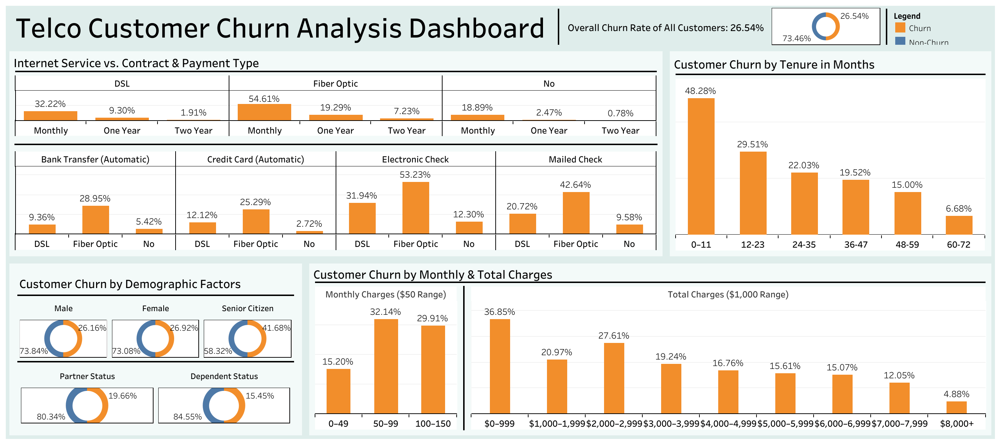

# Customer Churn Analysis - Google Data Analytics Capstone Project

## Overview
This capstone project explores customer churn patterns for a telecommunications company using a publicly available dataset. The analysis focuses on understanding how customer demographics, service usage, and financial variables influence churn behavior. Visualizations were created using Excel and Tableau to derive key insights and present them in a business-focused manner.

## Objective
Identify trends, correlations, and key factors that influence customer churn, and provide actionable business insights to help reduce churn and improve customer retention.

## Data Source
The dataset used in this project is publicly available on Kaggle:
[Kaggle Dataset by BlastChar](https://www.kaggle.com/datasets/blastchar/telco-customer-churn)

Description: This dataset includes 7,043 customer records with 21 variables including demographic details, account information, service usage, and churn label.

License: Provided under the Kaggle Terms of Use. All rights belong to the original author.

## Content Description
Each row represents a unique customer. Each column contains customer attributes described in the dataset metadata. The dataset includes:

- Churn Status: Whether the customer left within the last month

- Service Information: Phone, multiple lines, internet, online security, online backup, device protection, tech support, streaming TV, and streaming movies

- Account Information: Tenure, contract type, payment method, paperless billing, monthly charges, and total charges

- Demographics: Gender, age range, presence of partners and dependents

## Tools & Techniques
- **Excel**: Data cleaning, pivot tables, bar charts, doughnut charts, grouped bin analysis

- **Tableau**: Interactive dashboard creation for churn analysis

- **Google Data Analytics Certificate Concepts**: Data cleaning, EDA, data visualization, stakeholder communication

## Project Files
```
/
├── README.md
├── LICENSE
├── data/
│   ├── telco_customer_churn_data.xlsx
├── analysis/
│   ├── telco_churn_analysis.xlsx
├── tableau_dashboard/
│   └── telco_customer_churn_analysis_dashboard.twb
├── images/
   └── dashboard_visual.png
```

## Key Questions & Insights

- Overall churn rate is 26.54%, signaling a need for retention initiatives.
- Month-to-month fiber optic customers churn the most.
- Electronic check payment users show higher churn.
- Customers with tenure less than 12 months have highest churn.
- Senior citizens churn more than younger customers.
- Bundled add-on services improve customer retention.

## Tableau Dashboard
An interactive Tableau dashboard titled "Telco Customer Churn Analysis Dashboard" presents insights through visualizations tailored for business understanding and stakeholder review.



[Click here to explore the dashboard on Tableau Public]
https://public.tableau.com/app/profile/hai.dang6069/viz/Telco_Customer_Churn_Analysis_Dashboard/Dashboard?publish=yes

Dashboard Features:
- Dynamic Hover Tooltips: While the visualizations display percentages for ease of comparison, hovering over each segment reveals exact customer counts (e.g., number of churned customers vs. total in each category).

- Drill-down Analysis: Users can explore how churn relates to contract type, internet service, payment method, and other customer attributes.

- Segmented Visualizations:

  - Overall churn rate doughnut chart

  - Churn by demographics (gender, senior status, partner, dependent)

  - Monthly & lifetime spending distributions

  - Service combinations (contract, internet, payment)

  - Tenure-based churn analysis

This interactivity supports both quick executive overview and deeper analytical exploration.

## How to Use This Repository
- Explore raw and cleaned datasets under /data
- View the Excel workbook containing raw, cleaned data, service analysis, and churn summary under /analysis
- Open the Tableau workbook using Tableau Public or Desktop to explore the dashboard
- Read this README for project context and analysis summary

## Contact
- LinkedIn: www.linkedin.com/in/hai-dang316
- Email: h.dang686@yahoo.com

Note: This project was completed as part of the Google Data Analytics Professional Certificate Capstone to showcase end-to-end data analysis skills including data cleaning, EDA, visualization, and business communication.
