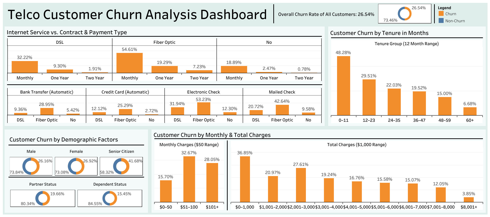

# Customer Churn Analysis - Google Data Analytics Capstone Project
**End-to-end churn analysis using real-world data | Excel, Tableau, EDA, Business Storytelling**


## Overview
This capstone project explores customer churn patterns for a telecommunications company using a publicly available dataset. The analysis focuses on understanding how customer demographics, service usage, and financial variables influence churn behavior. Visualizations were created using Excel and Tableau to derive key insights and present them in a business-focused manner.


## Objective
Identify trends, correlations, and key factors that influence customer churn, and provide actionable business insights to help reduce churn and improve customer retention.


## Data Source
The dataset used in this project is publicly available on Kaggle:
[Kaggle Dataset by BlastChar](https://www.kaggle.com/datasets/blastchar/telco-customer-churn)

Description: This dataset includes 7,043 customer records with 21 variables including demographic details, account information, service usage, and churn label.

License: Provided under the Kaggle Terms of Use. All rights belong to the original author.


## Content Description
Each row represents a unique customer. Each column contains customer attributes described in the dataset metadata. The dataset includes:

- Churn Status: Whether the customer left.

- Service Information: Phone, multiple lines, internet, online security, online backup, device protection, tech support, streaming TV, and streaming movies.

- Account Information: Tenure, contract type, payment method, paperless billing, monthly charges, and total charges.

- Demographics: Gender, age range, partner and dependent status.


## Data Cleaning and Preparation

- Column headers were standardized by capitalizing all names for consistency.

- The **Senior Citizen** column was transformed from numeric values (0/1) to categorical labels ("No"/"Yes") to improve clarity.

- A new column, **Number of Add-on Services**, was created to quantify how many additional services each customer subscribes to. This supports more detailed churn analysis by service adoption.

- Missing or blank values in the **Total Charges** column were highlighted in light green for easy identification. For customers with zero tenure (i.e., no active months), total charges were set to zero using the formula:

```excel
=IF(Tenure=0, 0, TotalCharges)
```

## Tools & Techniques
- **Excel**: Data cleaning, pivot tables, bar charts, doughnut charts, grouped bin analysis. Highlighted key churn rates in orange for visual emphasis.

- **Tableau**: Interactive dashboard creation for churn analysis.

- **Google Data Analytics Certificate Concepts**: Data cleaning, EDA, data visualization, stakeholder communication.


## SQL Queries
This repository includes key SQL queries that replicate the logic behind major metrics and visualizations used in the dashboard.

- Calculating the overall churn rate compared to total customers.
- Segmenting churn by internet service type, contract type, and payment method.
- Analyzing churn across demographic groups like gender, senior citizen status, partner, and dependents.
- Grouping customers by tenure and monthly/total charges for churn pattern analysis.
- Examining churn rate by number of add-on services.

These queries demonstrate practical use of aggregation, filtering, grouping, and conditional logic to derive actionable business insights from raw customer data.


## Project Structure
```
/
├── 1_data/
│   └── telco_customer_churn_data.csv
├── 2_analysis/
│   └── telco_churn_analysis.xlsx
├── 3_sql_queries/
│   └── churn_analysis.sql
├── 4_tableau_dashboard/
│   └── telco_customer_churn_analysis_dashboard.twb
├── 5_images/
│   └── dashboard_visual.png
├── LICENSE
└── README.md

```


## Key Questions & Insights
- Overall churn rate is 26.54%, meaning over a quarter of customers have discontinued service.

- Month-to-month fiber optic customers exhibit the highest churn, indicating low retention in short-term plans.

- Electronic check users have the highest churn across internet types, especially among fiber users.

- Customers with tenure under 12 months churn the most; churn declines as tenure increases.

- Senior citizens churn at a higher rate than younger customers, though gender shows minimal effect.

- Partners and dependents reduce churn risk, suggesting family ties support customer retention.

- Monthly charges above $50, especially in the $50–$99 range, are linked to higher churn.

- Low lifetime spenders (under $1,000) churn more; high-value customers are more loyal.

- No significant churn difference is seen between users with or without multiple phone lines.

- Customers with 4+ internet add-ons (e.g., backup, security, streaming) churn less, showing the benefit of bundled services.


## Tableau Dashboard
An interactive Tableau dashboard titled "Telco Customer Churn Analysis Dashboard" presents insights through visualizations tailored for business understanding and stakeholder review.



[Click here to explore the dashboard on Tableau Public](https://public.tableau.com/app/profile/hai.dang6069/viz/Telco_Customer_Churn_Analysis_Dashboard/Dashboard?publish=yes)

Dashboard Features:
- Dynamic Hover Tooltips: While the visualizations display percentages for ease of comparison, hovering over each segment reveals exact customer counts (e.g., number of churned customers vs. total in each category).

- Drill-down Analysis: Users can explore how churn relates to contract type, internet service, payment method, and other customer attributes.

- Segmented Visualizations:

  - Overall churn rate doughnut chart

  - Churn by demographics (gender, senior status, partner, dependent)

  - Monthly & lifetime spending distributions

  - Service combinations (contract, internet, payment)

  - Tenure-based churn analysis

  - Churn distribution by monthly charges and total (lifetime) charges

This interactivity supports both quick executive overview and deeper analytical exploration.


## How to Use This Repository
- Explore raw dataset under /1_data.
- View the Excel workbook containing raw, cleaned data, service analysis, and churn summary under /2_analysis.
- Open the Tableau workbook using Tableau Public or Desktop to explore the interactive dashboard under /4_tableau_dashboard.
- View the dashboard screenshot under /5_images for a quick visual reference.
- Read this README for project context, methodology, and key insights.


## Contact
- [LinkedIn](https://www.linkedin.com/in/hai-dang316)
- Email: h.dang686@yahoo.com

Note: This project was completed as part of the Google Data Analytics Professional Certificate Capstone to showcase end-to-end data analysis skills including data cleaning, EDA, visualization, and business communication.
